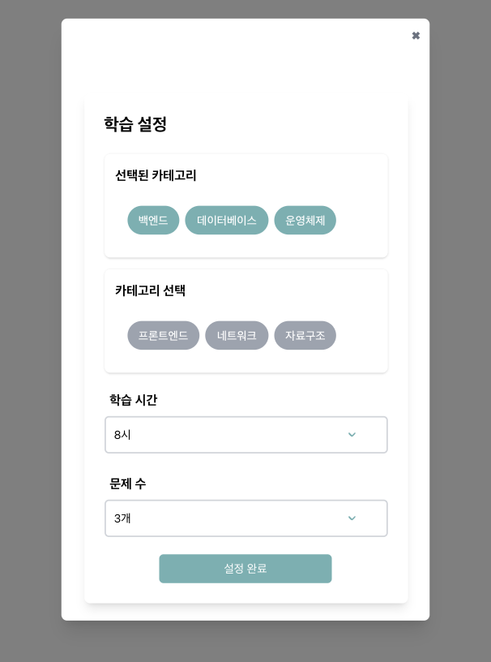

# ✨ HaruHana - 나만의 학습 설정 프로젝트 ✨

## 💡 기획 의도

혹시 [매일 메일](https://www.maeil-mail.kr/) 서비스에 대해 들어보신 적 있으신가요?


[매일 메일](https://www.maeil-mail.kr/) 서비스는 매일 아침마다 기술 면접 질문을 이메일로 받아보고 답변을 확인하며 면접 준비를 할 수 있는 서비스에요.


저희는 이 서비스에서 영감을 받아, 개발자를 꿈꾸는 사람들이 매일 꾸준히 CS 지식과 웹 개발 실력을 쌓을 수 있는 플랫폼을 만들고자 했어요.

## 📌 프로젝트 소개

HaruHana는 웹 개발과 CS 공부를 더 쉽고 재미있게 할 수 있도록 도와주는 서비스에요.

사용자는 원하는 카테고리를 선택하고, 학습 시간과 문제 수를 조절하여 자신에게 딱 맞는 학습 환경을 설정할 수 있어요.

## 👨‍👧‍👧 팀 소개

HaruHana 프로젝트는 다음과 같은 팀원들로 구성되어 있어요.

| [남승현](https://github.com/namsh1125)    | [김새봄](https://github.com/saebomnewspring) | [윤예진](https://github.com/yezanee)        |
| ----------------------------------------- | -------------------------------------------- | ------------------------------------------- |
|  |    |  |
| 팀장                                      | 팀원                                         | 팀원                                        |

## 🌐 배포

HaruHana는 [Docker](Dockerfile)와 [GitHub Actions](.github/workflows/build_and_deploy_production_app.yml)를 이용해 배포되고 있어요.

아래 링크를 통해 HaruHana 서비스를 이용해보실 수 있어요.

🔗 [👉 HaruHana 바로가기](http://haruhana.woorifisa.site)

## 📦 폴더 구조

HaruHana는 아래와 같은 폴더 구조로 이루어져 있어요.

```text
.
├── Dockerfile               # 도커 이미지 빌드 파일
├── README.md                # 프로젝트 소개 및 설명 파일
├── app                      # Next.js 프로젝트 폴더. 전체 프로젝트의 루트 폴더
│   ├── (landing)              # 랜딩 페이지
│   ├── api                    # API 요청 관련 폴더
│   ├── login                  # 로그인 페이지
│   ├── logout                 # 로그아웃 페이지
│   ├── mypage                 # 마이페이지
│   ├── problem-list           # 문제 리스트 페이지
│   ├── questions              # 문제 페이지
│   ├── signup                 # 회원가입 페이지
│   ├── statistics             # 통계 페이지
│   ├── layout.js              # 레이아웃 파일
│   └── globals.css            # 전역 CSS 파일
│
├── components               # 재사용 가능한 컴포넌트 관련 폴더
│   ├── chart                  # 차트 컴포넌트
│   ├── landing                # 랜딩 페이지 관련 컴포넌트
│   ├── modal                  # 모달 관련 컴포넌트
│   ├── mypage                 # 마이페이지 관련 컴포넌트
│   ├── problem-list           # 문제 리스트 페이지 관련 컴포넌트
│   ├── problems               # 문제 페이지 관련 컴포넌트
│   ├── statistics             # 통계 페이지 관련 컴포넌트
│   └── ui                     # 공통 UI 컴포넌트
│
├── constants                # 상수 관련 폴더
│   └── chartColors.js         # 차트 색상 상수 파일
│
├── contexts                 # Context API 관련 폴더
│   └── QuestionContext.jsx    # 문제 관련 Context API 파일
│
├── data                     # 데이터 관련 폴더
│   └── user.js                # 사용자 정보 데이터 파일
│
├── docs                     # README.md에 사용되는 이미지 파일을 저장하는 폴더
├── eslint.config.mjs        # ESLint 설정 파일
├── jsconfig.json            # JSConfig 설정 파일
├── next.config.mjs          # Next.js 설정 파일
├── node_modules             # Node.js 모듈 폴더
├── package.json             # 프로젝트 정보 및 의존성 관리 파일
├── pages                    # Next.js 페이지 라우트
│   └── api                    # API 엔드포인트
│
├── pnpm-lock.yaml           # pnpm 패키지 의존성 관리 파일
├── postcss.config.mjs       # PostCSS 설정 파일
├── public                   # 이미지, 아이콘 등 정적 파일을 저장하는 폴더
├── styles                   # 전역 CSS 파일을 저장하는 폴더
│   └── react-grid.css         # React Grid 스타일 파일 (차트 페이지에서 사용)
│
├── tailwind.config.mjs      # Tailwind CSS 설정 파일
└── utils                    # 유틸리티 함수 관련 폴더
    └── statisticUtils.js      # 통계 관련 유틸리티 함수 파일
```

해당 구조는 [Next.js 프로젝트의 기본 구조](https://nextjs-ko.org/docs/getting-started/project-structure)를 따르려고 노력했어요.

## 🖥️ 화면 구성

HaruHana는 다음과 같은 화면으로 구성되어 있어요.

### [ 랜딩 페이지 ]


사용자가 처음 접하는 화면이에요.

사용자는 랜딩 페이지에서 로그인을 하거나 회원가입을 할 수 있어요.

### [ 로그인 ]


사용자가 HaruHana 서비스를 이용하기 위해서는 로그인이 필요해요.

로그인을 하지 않은 사용자는 로그인 페이지에서 로그인을 할 수 있어요.

### [ 회원 가입 ]


HaruHana 서비스를 이용하기 위해서는 회원 가입이 필요해요.

회원 가입을 하지 않은 사용자는 회원 가입 페이지에서 회원 가입을 할 수 있어요.

### [ 사용자 정보 입력 모달창 ]



사용자가 처음 학습을 시작할 때, 원하는 학습 스타일을 설정할 수 있는 화면이에요.

- 카테고리 선택: 백엔드, 프론트엔드, 네트워크, 데이터베이스, 운영체제, 자료구조 등 원하는 분야를 골라 학습할 수 있어요.
- 학습 시간 설정: 하루에 공부할 시간을 정하고 루틴을 만들 수 있어요.
- 문제 수 설정: 원하는 만큼 문제를 풀면서 실력을 쌓을 수 있어요.

### [ 마이페이지 ]


마이페이지에서는 사용자의 학습 정보를 한 눈에 확인할 수 있어요.

학습 캘린더를 통해 어떤 날에 얼마나 학습했는지 한 눈에 확인할 수 있어요.

### [ 차트 통계 분석 ]


학습한 내용을 차트로 시각화하여 보여주어 자신의 학습 성취도를 확인할 수 있어요.

### [ 오늘의 문제 ]


사용자가 설정한 학습 정보에 맞춰 맞춤형 문제를 제공하는 화면이에요.

사용자가 해당 화면을 통해 문제를 풀면서 실력을 키울 수 있어요.

### [ 문제 리스트 ]


HaruHana에서는 다양한 카테고리와 난이도의 문제를 제공하고 있어요.

사용자는 HaruHana에서 제공하는 문제를 풀면서 실력을 키울 수 있어요.

## 🌐 Mock 서버

HaruHana에서는 실제 백엔드 API를 개발하기 전에, 프론트엔드 개발을 원활하게 진행할 수 있도록 Mock 서버를 운영하고 있어요.

📍**Mock 서버 정보**

Repository: [**Haruhana mock server**](https://github.com/woorifisa-service-dev-4th/frontend-4th-haruhana-mock-server)

아래 링크를 클릭하면 운영 중인 Mock 서버에 접속할 수 있어요.

[**👉 Mock 서버 바로가기**](http://api.haruhana.woorifisa.site:8080/)

## 📈 LightHouse 성능 지표


## Convention

### [prettier-vscode에서 저장만하면 자동으로 적용하는 방법](how-to-prettier.md)

### File

HaruHana는 Nextjs에서 제공하는 [Convention](https://nextjs-ko.org/docs/getting-started/project-structure)을 따르고 있어요.

### Branch Strategy


저희는 Git Flow 전략을 기반으로 개발을 진행했어요.

### Commit Message

커밋 메시지는 다음과 같은 형식으로 작성하고 있어요.

```
<이모지> <커밋 메시지>
```

이모지의 경우 아래와 같은 종류로 구분하고 있어요.

| **이모지** | **의미**             | **설명**                                               | **예시**                            |
| ---------- | -------------------- | ------------------------------------------------------ | ----------------------------------- |
| 🎨         | 코드 구조/형식 개선  | 코드의 기능 변경 없이 리팩토링이나 코드 스타일을 개선. | `🎨 CSS 클래스 이름 리팩토링`       |
| ✨         | 새로운 기능 추가     | 기존 코드에 새로운 기능을 추가.                        | `✨ 사용자 인증 기능 추가`          |
| 🐛         | 버그 수정            | 코드의 버그를 수정.                                    | `🐛 로그인 버튼 오류 수정`          |
| 📝         | 문서화               | README, 주석 등 문서와 관련된 작업.                    | `📝 API 문서 업데이트`              |
| 💄         | UI/스타일 수정       | CSS 변경 등 사용자에게 보이는 부분의 스타일 변경.      | `💄 버튼 색상 업데이트`             |
| 🔧         | 설정 파일 수정       | ESLint, Prettier 등 설정 파일 변경.                    | `🔧 ESLint 규칙 업데이트`           |
| ✅         | 테스트 추가/수정     | 테스트 코드와 관련된 작업.                             | `✅ 로그인에 대한 단위 테스트 추가` |
| 🔥         | 코드 및 파일 삭제    | 불필요한 코드나 파일 삭제.                             | `🔥 사용하지 않는 CSS 파일 삭제`    |
| ♻️         | 코드 리팩토링        | 성능 개선, 가독성 향상을 위해 기존 코드 수정.          | `♻️ 인증 로직 리팩토링`             |
| 🗑️         | 파일 삭제            | 더 이상 필요 없는 파일 삭제.                           | `🗑️ 사용되지 않는 설정 파일 제거`   |
| ⚡         | 성능 개선            | 속도나 효율성을 개선하기 위한 코드 변경.               | `⚡ 데이터베이스 쿼리 속도 개선`    |
| 🚑         | 긴급 수정            | 치명적인 문제나 버그를 빠르게 수정.                    | `🚑 홈페이지 깨짐 문제 핫픽스`      |
| 📦         | 패키지 추가/업데이트 | npm, Yarn 등 패키지 매니저를 통한 패키지 변경.         | `📦 React 버전 업그레이드`          |
| 🎉         | 초기 작업            | 프로젝트의 초기 설정 및 파일 추가.                     | `🎉 프로젝트 초기화`                |
| 🚚         | 파일/폴더 이동       | 파일이나 폴더의 위치를 변경.                           | `🚚 에셋 폴더 이동`                 |
| ➕         | 종속성 추가          | 새로운 라이브러리나 종속성 추가.                       | `➕ lodash 종속성 추가`             |
| ➖         | 종속성 제거          | 사용하지 않는 라이브러리나 종속성 제거.                | `➖ jQuery 제거`                    |

# 📌 HaruHana와 함께 하루하나씩 실력을 키워봐요! 🌱
